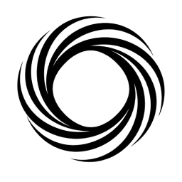
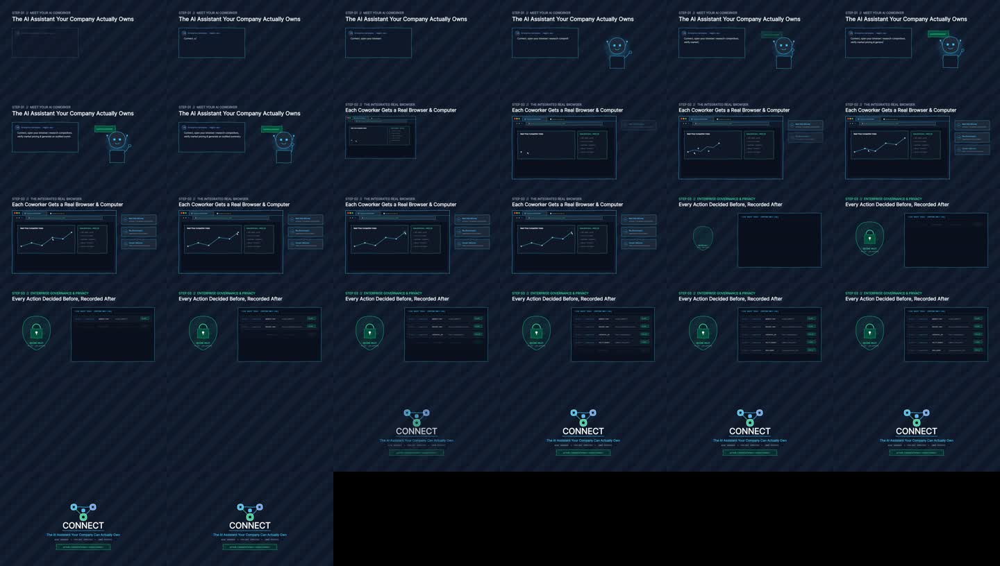
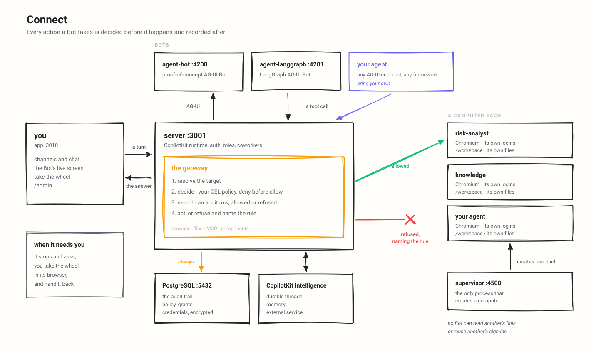

<div align="center">



# Connect

**The self-hosted AI coworker workspace your company actually owns.**  
Same intuitive experience as ChatGPT, Claude or Grok — running on your own infrastructure, with full control over data, agents, and an integrated real browser.

[**Quick Start**](#quick-start) · [**Desktop App & AI-Browser**](#desktop-app--integrierter-ai-browser) · [**Monorepo-Architektur**](MONOREPO-STRUCTURE.md) · [**Docs**](docs/README.md) · [**Cloud Deploy**](CLOUD-DEPLOY.md)

[](./LICENSE)


<br/>

<a href="assets/demo-connect.mp4">
  
</a>

<p><em>🎬 Handgezeichneter Animationsfilm: Connect AI Coworker, integrierter Browser & isolierte Computer-Infrastruktur. (<a href="assets/demo-connect.mp4">Demo-Video ansehen: assets/demo-connect.mp4</a>)</em></p>

</div>

---

## Was ist Connect?

Connect ist eine vollwertige Plattform für autonome KI-Mitarbeiter (Agents), die direkt in deiner eigenen Infrastruktur läuft:
* **Echte Computer & echter Browser für jeden Agenten:** Jeder Bot erhält seinen eigenen isolierten Container mit Chromium, eigenem Dateisystem (`/workspace`) und separaten Logins.
* **Integrierter Windows Desktop AI-Browser:** Native .NET 8 / WebView2 Desktop-App ohne iframe-Sperren (`X-Frame-Options`) mit lokaler HTTP-Automations-Bridge.
* **Sicheres Gateway:** Jede Aktion (Browser-Klick, Datei-Zugriff, MCP-Aufruf) wird vor der Ausführung per CEL-Policy geprüft und im Audit-Log festgehalten.
* **Volle Datenhoheit:** Alle Konversationen und Daten liegen in deiner PostgreSQL-Datenbank. Keine Daten fließen ungefragt an Dritte ab.

---

## Desktop App & Integrierter AI-Browser

In Ergänzung zur Web-Oberfläche (`http://localhost:3010`) enthält Connect eine native Windows-Desktop-Anwendung unter `desktop/connect-browser/`:

```
┌─────────────────────────────────────────────────────────────┐
│  Connect Desktop (.NET 8 + WebView2)                        │
├─────────────────────────────────────────────────────────────┤
│  Tabs: [ 🏢 Connect Workspace ]   [ 🌐 Echter AI-Browser ]  │
├─────────────────────────────────────────────────────────────┤
│  Toolbar: [◀] [▶] [↻] [⌂] [ https://google.com         ] [Go│
├──────────────────────────────┬──────────────────────────────┤
│                              │  Lokale AI-Automation Bridge │
│   WebView2 (Echter Browser)  │  (HTTP Port 3002)            │
│   • Keine iframe-Blockaden   ├──────────────────────────────┤
│   • Google & Web3 Logins     │  Befehle für KI-Agenten:     │
│   • Live-DOM & Screenshots   │  • POST /api/browser/navigate│
│                              │  • POST /api/browser/eval    │
│                              │  • GET  /api/browser/snapshot│
│                              │  • GET  /api/browser/screenshot│
└──────────────────────────────┴──────────────────────────────┘
```

### Starten der Desktop-App:
Einfach Doppelklick auf:
```cmd
START-CONNECT-BROWSER.cmd
```
Oder manuell bauen:
```cmd
cd desktop\connect-browser
dotnet build -c Release
"bin\Release\net8.0-windows\Connect Desktop.exe"
```

---

## Monorepo-Architektur (inspiriert von OneKey)

Das Repository ist modular aufgebaut (siehe [MONOREPO-STRUCTURE.md](MONOREPO-STRUCTURE.md)):

```text
Connect Monorepo
├── apps/
│   ├── desktop/                # Native Windows Desktop App (.NET 8 + WebView2)
│   ├── web/ (app/)             # Vite + React Web Frontend (Port 3010)
│   ├── server/                 # Hono API & Better Auth Server (Port 3001)
│   ├── supervisor/             # Docker Sandbox Supervisor
│   └── worker/                 # Scheduled Routines Worker
├── packages/
│   ├── shared/                 # Gemeinsame Typen & Verträge
│   └── agents/                 # Runtimes: agent-computer, agent-bot, etc.
├── development/                # Entwicklungs-Tools (START-PC.cmd, activate-google-oauth.sh)
└── docs/                       # Dokumentation (Architektur, Cloud-Deploy, OAuth)
```

---

## Quick Start

### 1. Voraussetzungen
- **WSL 2 (Ubuntu)** mit PostgreSQL oder **Docker Desktop**
- **Bun 1.3+** (für App und API-Server)
- **.NET 8 SDK** (für die Windows Desktop-App)

### 2. Ein-Klick-Start (All-in-One)
Unter Windows einfach Doppelklick auf:
```cmd
START-CONNECT-BROWSER.cmd
```
Dieses Skript prüft und startet vollautomatisch:
1. PostgreSQL Datenbank (WSL / Docker)
2. Connect API Backend (`http://localhost:3001`)
3. Connect Workspace Web App (`http://localhost:3010`)
4. Connect Desktop App mit integriertem AI-Browser (`Connect Desktop.exe`)

### 3. Stack manuell starten
Unter Windows:
```cmd
START-PC.cmd
```
Unter Linux / WSL:
```sh
bash scripts/start.sh
```

- **Web-UI:** [http://localhost:3010](http://localhost:3010)
- **API-Server:** [http://localhost:3001](http://localhost:3001)
- **Desktop-App:** `START-CONNECT-BROWSER.cmd`

---

## Architektur

<picture>
  <source media="(prefers-color-scheme: dark)" srcset="assets/architecture-dark.svg">
  
</picture>

| Dienst | Port | Zweck |
|---|---|---|
| **Connect Web-UI** | `3010` | React / Vite Benutzeroberfläche |
| **Connect API Server** | `3001` | Hono Backend, Better Auth, Policies & Kanäle |
| **Desktop AI-Bridge** | `3002` | Lokale Automations-Schnittstelle im Desktop-Browser |
| **agent-computer** | `4100` | Chromium-Automationscontainer mit persistentem Workspace |
| **supervisor** | `4500` | Verwaltet und isoliert Bot-Container |
| **PostgreSQL** | `5432` | Sessions, Accounts, Audit-Logs, Kanäle und Routinen |

---

## Authentifizierung

Connect unterstützt enterprise-taugliche Authentifizierung über **Better Auth**:
* **Google OAuth:** Desktop- und Web-Client vorkonfiguriert.
* **Microsoft Entra ID (Azure AD):** Für Firmenaccounts.
* **SAML / OIDC:** Eigene Identity-Provider im Admin-Panel nach Domain routbar.

Anleitung: [WEB-GOOGLE-AUTH.md](WEB-GOOGLE-AUTH.md)

---

## Dokumentation

- [MONOREPO-STRUCTURE.md](MONOREPO-STRUCTURE.md) — Detaillierte Monorepo-Übersicht
- [CLOUD-DEPLOY.md](CLOUD-DEPLOY.md) — Cloud Deployment & Hosting
- [WEB-GOOGLE-AUTH.md](WEB-GOOGLE-AUTH.md) — Google OAuth Setup
- [docs/architecture.md](docs/architecture.md) — Tiefgehende Systemarchitektur
- [docs/configuration.md](docs/configuration.md) — Alle Umgebungsvariablen

---

## Lizenz

[MIT](./LICENSE) © Connect Team
